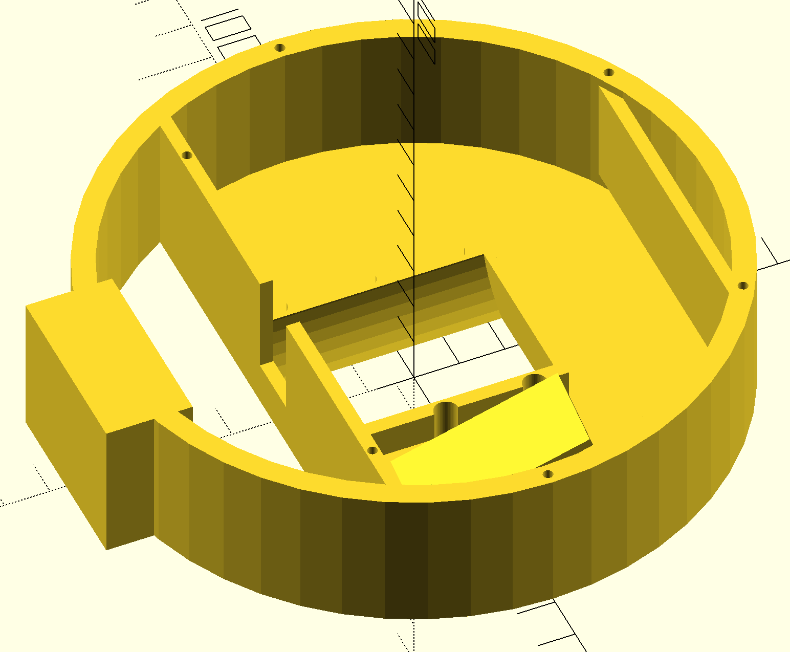
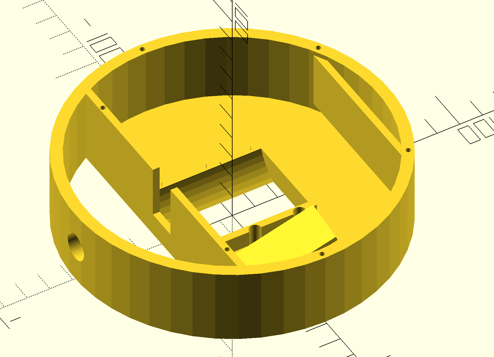
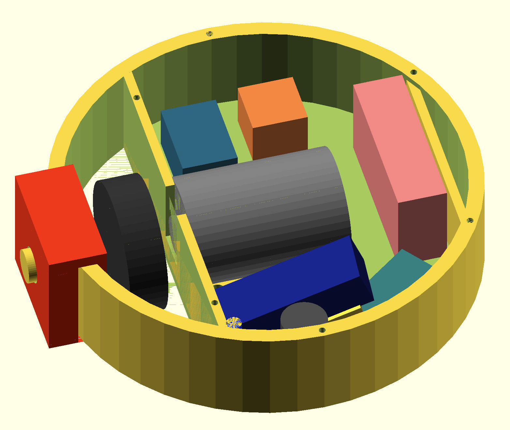
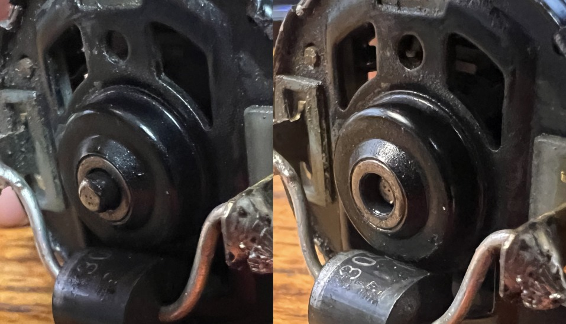
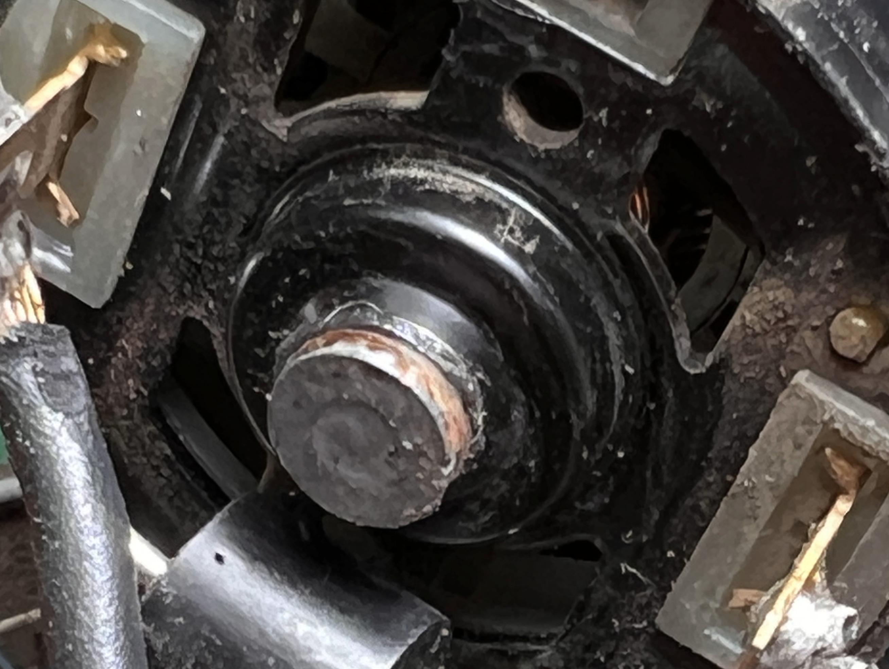
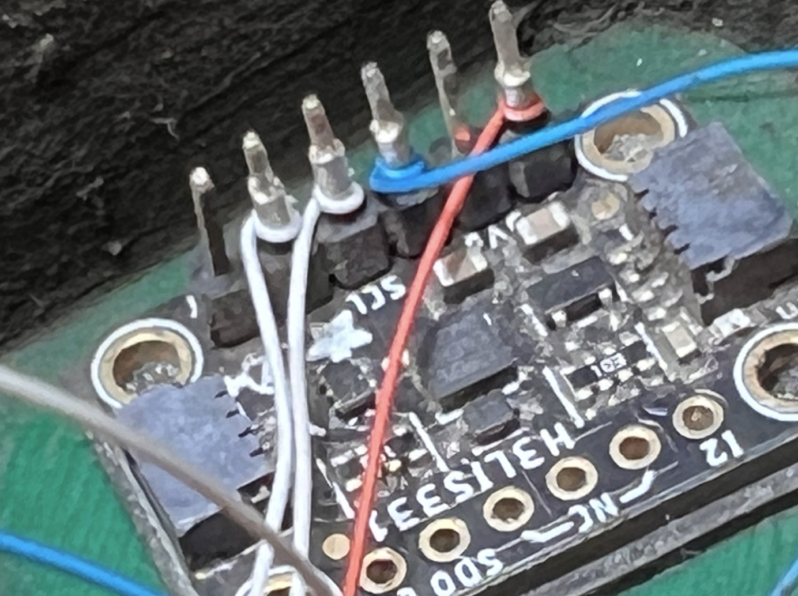
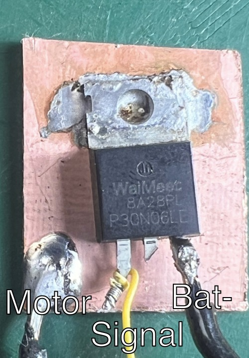
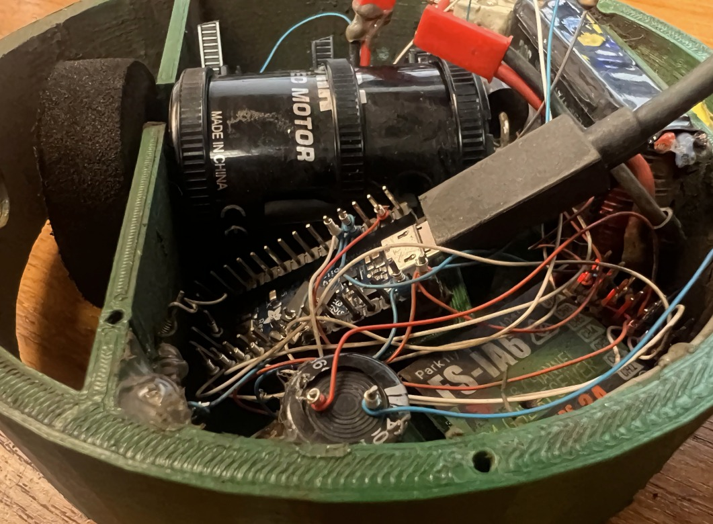

# Open Melt Antweight Reference Platform

This robot was created as an easy-to-build, 3d-printed test platform for Open Melt.  All design files are provided.

Being Arduino based - no special programmer is required.  No custom PCB's or fine-pitch soldering is needed.  All components are readily available as of this writing.

It is intended to comply with [Plastic Antweight combat robot rules](https://www.westernalliedrobotics.com/index.php/the-rules/special-plastic-class-rules).  The total weight of the test build is about 0.5oz under the 16oz weight limit.

This robot can spin up to around 3000rpm.  It is capable of causing projectiles that could seriously injure someone.  It is recommended you only test inside an enclosed arena.

The option for a removable weapon is intended to provide a less-scary way to test a melty brain robot.  Proper precautions should still be taken.

## Parts List
- [Arduino Micro](https://store.arduino.cc/products/arduino-micro) or [Adafruit ItsyBitsy 32u4 - 5V 16MHz](https://www.adafruit.com/product/3677)
- [Adafruit H3LIS331 breakout](https://www.adafruit.com/product/4627)
- RFP30N06LE n-channel MOSFET (widely available)
- [30SQ045 Schottky Diode](https://www.digikey.com/en/products/detail/anbon-semiconductor-int-l-limited/30SQ045/18800935)
- 3mm blue LED (rated 20ma or higher)
- [FlySky i6 transmitter ](https://www.flysky-cn.com/i6-gaishu) and [FlySky iA6 receiver](https://www.flysky-cn.com/ia6-canshu)
- 45-turn 540 size RC car motor ("torque" or "crawler")
- [FingerTech Mini Power Switch](https://www.fingertechrobotics.com/proddetail.php?prod=ft-mini-switch)
- [FingerTech Twist Hub (3mm / 0.5")](https://www.fingertechrobotics.com/proddetail.php?prod=ft-twist-hubs)
- [FingerTech Foam Wheel (1.75" x 0.5")](https://www.fingertechrobotics.com/proddetail.php?prod=ft-foam-wheels)
- ~900ma 7.4v lithium polymer battery
- 4700uf electrolytic capacitor (30mm or shorter for easy fit)
- 100, 10k and 100k Ohm resistors

## Fasteners / Tools / Misc.:
 - [\#2-28 x 1/4" Phillips Screws](https://www.mcmaster.com/products/plastite-screws/screw-size~no-2/length~1-4-2/length~0-25/)
 - Zip Ties
 - Mounting tape (Scotch Extreme or similar)
 - Hot glue gun ("hot" melt as opposed to "low" melt)
 - Small piece of PCB blank or copper sheet
 - Access to a 3d-printer / PLA filament
 - [Wire wrapping tool](https://www.amazon.com/Wire-Wrap-Gauge-ELECTRONIX-EXPRESS/dp/B00BFYE0CY/)
(3052050)

## Overview / Weight Budget

| Component                    | Weight (grams) |
|------------------------------|----------------|
| Shell                        | 140            |
| Lid                          | 18             |
| Motor                        | 172            |
| Battery                      | 46             |
| MCU                          | 3              |
| RC Receiver                  | 2              |
| Mosfet + heatsink            | 6              |
| Wires, LED, diode, switch    | 4              |
| Wheel + hub                  | 9              |
| Weapon + pin                 | 30             |
| Power switch                 | 4              |
| 4700uf capacitor             | 4              |
| **Estimated Total**          | **438**        |
| **Measured Total (fully assembled)** | **440 (15.5oz)** |

## 3d Model / OpenSCAD
The body of this robot was designed in [OpenSCAD](https://openscad.org/) (programmatic CAD).  You can easily change parameters to adjust things like shell thickness and diameter.

<table><tr><td>
</td><td>

</td>
</tr><td colspan="2" align="center">
</td></tr>
</table>

Stand-ins for electronics can be rendered to verify everything fits as intended.

The following STL files are provided for 3d-printing:
<table>
<tr><td>Robot shell without weapon (weapon mounting hole)</td><td>shell\_no\_weapon.stl</td></tr>
<tr><td>Detachable weapon</td><td>weapon.stl</td></tr>
<tr><td>Weapon mounting pin</td><td>weapon\_pin.stl</td></tr>
<tr><td>Robot lid</td><td>lid.stl</td></tr>
<tr><td>Robot shell with integrated weapon</td><td>shell\_with\_weapon.stl</td></tr>
</table>

## 3d Printing Notes
The test build of the robot is printed in PLA with 100% infill.

Using a high shell count (5+) may help with strength.  Avoid using a cooling fan for maximum strength.

## General Construction
The lid is held on with the \#2 screws.  They seem to self-tap pretty effectively.

The accelerometer, motor driver, Arduino and battery are all secured using the double-sided tape.

The Arduino is installed on a special shelf that rises up from the floor at an angle.  This allows a USB cable to be attached to it for programming after assembly.

The battery is taped both against the floor of the robot - and the flat section of wall behind it.  There is clearance under the flat wall for a zip-tie if more security is desired (good idea).

The power switch, LED, and resistors are all held in place with a little hot glue.

The motor is held into place using zip ties.

This all seems to work! You might have better / more robust ideas.  (again - this robot is not battle tested)

## Motor / Modification
A 45-turn 540-sized "sealed endbell" hobby motor is used.  

The number of turns determines how fast the motor rotates for a given voltage.  A 45-turn motor is considered a slower or "torque / crawler" motor.  

Using a lower turn motor has not been tested - and may overtax the MOSFET.

The 1-wheel robot results in a constant pulling force on the motor as it rotates.  This will cause the motor shaft to become loose overtime (specifically - there is a shim on the shaft that slips).  These motors tend to still run - but are noisy, slower and less efficient.  One solution is to just replace the motor when it gets worn-out.

Worn Motor Showing ~2mm play in shaft

A 3.2mm washer can be soldered on the rear tip of the shaft.  I high temperature soldering gun and use of flux will help assure a good bond is made.

Worn Motor Showing ~2mm play in shaft

## Detachable Weapon

A shell option without a built-in weapon is provided.  Building the robot without a weapon is a good way to test with minimal "drama."

This shell includes a mounting hole so that a weapon may be attached later using a peg.  No assurances are given about the robustness of this approach.  Using hot-glue to re-enforce weapon attachment may prove useful.

## Wheel Hub
The wheel hub is specified as 3mm, where the motor has a shaft of 3.175mm (1/8").  It will need to be very slightly drilled out.

## Schematic

## Wiring Things (Wire Wrap)
Using ["wire wrap"](https://learn.sparkfun.com/tutorials/working-with-wire/how-to-use-a-wire-wrap-tool) for all signal and low-power connections is recommended.  When done properly wire-wrap connections are reliable and provide strain relief.  The small gauge wires minimize the stress put on connections under the stresses experienced by a melty bot.

Wire wrapping has fallen out-of-fashion - but there is a reason they used this approach for the [Apollo Guidance Computer](http://www.righto.com/2019/07/software-woven-into-wire-core-rope-and.html).

If using another approach - just keep in mind the 200+g forces.  Temporary "Dupont wire" jumpers are not likely to work reliably.

If trying a different approach - keep

## Motor Driver

The RFP30N06LE is a widely available N-Channel MOSFET.  The original FairChild / onsemi version seems discontinued - but many manufacturers still make versions of it.

Cut a small piece of PCB blank or thin copper sheet - and solder the tab of the RFP30N06LE to it.  This will provide a crude heatsink.

The tab is electrically equivalent to the middle pin.  The motor may be directly connected to the copper PCB surface (the middle pin may be cut off).

The PCB blank / copper sheet provides adequate surface area to be mounted using double-sided tape.

## Battery
The [7.4v 900mAh battery](https://www.amazon.com/dp/B09BYVNH2N?psc=1&ref=ppx_yo2ov_dt_b_product_details) used for test build is specified as 53x29x16mm (46 grams).  The key dimension is that it needs to be <30mm wide in order to fit as oriented.

Runtime on a full battery charge is over 6 minutes.  A somewhat smaller battery could probably be used.

Upgrading to a 11.1v battery may be possible - but could be too much for the MOSFET to handle.

## Battery Voltage Monitor
Two resistors (10k and 100k Ohm) as shown in the schematic are required to create the 10:1 voltage divider needed for battery monitoring / alarm.

These can be hot-glued someplace convenient in the chassis.

The voltage monitor is optional - but a good idea to avoid over-discharging your battery.

See BATTERY\_ALERT\_ENABLED and BATTERY\_ADC\_WARN\_VOLTAGE\_THRESHOLD in [melty_config.h](openmelt/melty_config.h) for options.

## Programming

Install the latest [Arduino IDE](https://www.arduino.cc/en/software) - then open the Open Melt project.  

