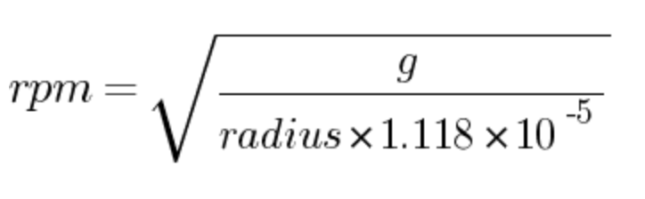
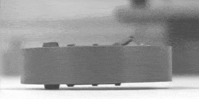
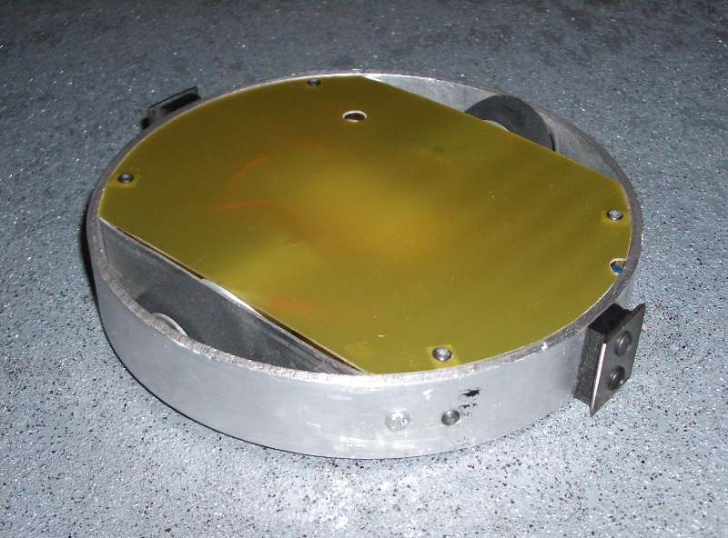
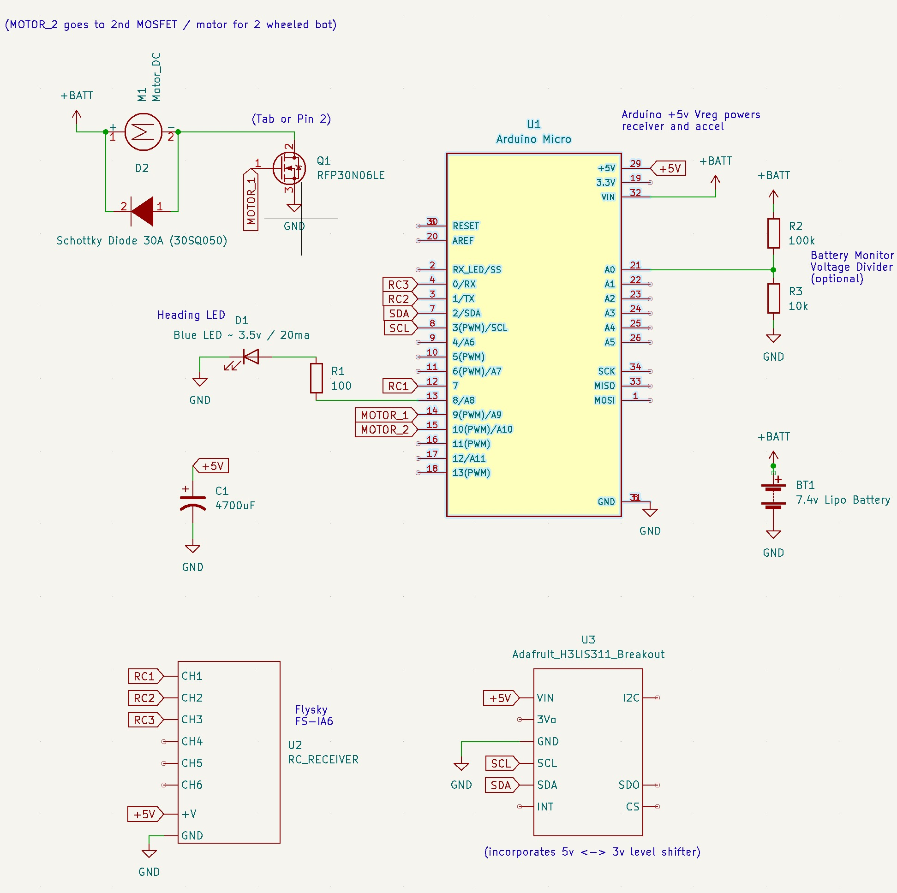
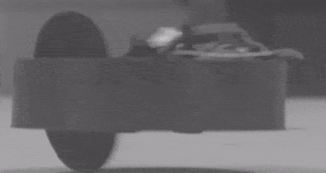

# Open Melt

Open Melt is an open-source translational drift (aka "melty brain") robot controller based on Arduino.

A translational drift robot spins its entire body using its drive wheel(s), but is still capable of directional control by modulating motor power at certain points each rotation.  To achieve this - the rate of rotation must be tracked.

<table class="center"><tr><td align="center">
<a href="./antweight_reference_platform/"> Antweight Reference Platform</a</td>
<td valign="center"></td>
<td align="center"> ~2300rpm</td>
</td></tr></table>

Open Melt uses an accelerometer to calculate the rate of rotation based on G-forces around a given radius (centrifugal force).  For example - an accelerometer mounted 4cm from the center of rotation experiencing 145g can be [calculated](https://druckerdiagnostics.com/g-force-calculator/) to indicate 1800rpm rotation.

An LED is turned on once per rotation - giving the appearance of the "front" of the robot.  This lets the driver see the expected direction of translation.  The user can adjust the heading beacon by moving the remote control left or right.  This allows for steering and correction of minor tracking errors.

The system can work with robots using either one or two drive motors.

It has been tested up to 3200rpm - and can likely work at significantly higher speeds.

Version 2 of the project is a complete recode (previously native Atmega/AVR).  The move to Arduino was done to make it more accessible and potentially portable to non-AVR platforms.

Open Melt was developed by Rich Olson ([nothinglabs.com](http://www.nothinglabs.com) / rich@nothinglabs.com) and is provided under the [Creative Commons Attribution-NonCommercial-ShareAlike](https://creativecommons.org/licenses/by-nc-sa/4.0/deed.en) license.

A longer demo video and some background on Open Melt are available at this [blog post](http://www.nothinglabs.com/open-melt-2/).

#### For a complete parts list, 3d print files and build notes see the [antweight reference platform](./antweight_reference_platform/).

## Demo Video

https://github.com/nothinglabs/openmelt2/assets/3834997/7247756d-c1fe-4b85-9fc3-9274c0709dcb

## General Hardware Requirements

- Arduino Micro (or other Atmega32u4 5v 16MHz Arduino / compatible)
- [H3LIS331](https://www.st.com/resource/en/datasheet/h3lis331dl.pdf) 400g accelerometer (recommended: [Adafruit H3LIS331 breakout](https://www.adafruit.com/product/4627))
- RC Transmitter / Receiver 
- Heading LED
- Motor Driver(s)
- Motor(s)

Use of an **Atmega328-based Arduino is not supported** due to lack of adequate interrupt pins.

The HSLI311 is a 3v part - but the Adafruit breakout includes a 3v<->5v level converter to make interfacing with the Arduino easy.  Alternatively, [Sparkfun's H3LIS331DL Breakout](https://www.sparkfun.com/products/14480) has been verified to work when used in conjunction with the [SparkFun 3v<->5v Logic Level Converter](https://www.sparkfun.com/products/12009).

## 1 vs. 2 Wheels
Open Melt generates signals for 2 motors independent of how many are connected.  Motor 2 is powered for the same portion of each rotation as motor 1 (trailing 180 degrees out of phase).

<table class="center"><tr><td>
</td>

<td></td>
</td></tr></table>

In a 1 wheel robot - the unsupported end scrapes the ground during spin-up - but then levitates when it reaches speed.  

## Accelerometer Placement
The accelerometer must be positioned so that it experiences no more than 400g at the robot's anticipated max rotation speed. A [centrifuge calculator](https://druckerdiagnostics.com/g-force-calculator/) may be used to determine this.

Open Melt provides an interactive setup routine that makes precise placement or orientation of the accelerometer unnecessary.

Alignment of the accelerometer off-axis will result in a linear error - which has the same effect as reducing the radius of rotation.  Placing will the accerometer at a 45 degree angle will effectively halve its sensitivity.  This may be useful in larger robots.

The software also corrects for installing the accelerometer 180 degrees rotated.

## Motor Driver(s) / Throttle Control

Open Melt can generate either a simple on / off motor signal - or provide a 0-100% 490Hz PWM signal.

Either kind of signal may be fed directly to a MOSFET or motor controller that accepts 5v logic-level input.

The antweight reference platform uses a RFP30N06LE N-Channel MOSFET.

Open Melt supports a few different throttle configurations - see [melty_config.h](openmelt/melty_config.h) for details.

In the default BINARY\_THROTTLE mode - the throttle level determines what portion of each rotation the motor(s) are powered (fully) on for.  For example - at 50% throttle the motors would be powered for 180 degrees of each rotation.  At higher throttle settings translation is reduced (with no translation at 100%).

When no forward or back translation is desired - the portion of the rotation that is powered is constantly cycled 180 degrees (cancelling out any translational drift).  

Brushless RC motor controllers that support high-speed 490Hz PWM may work with Open Melt.  A "Hobbypower 30a" brushless controller running the [SimonK firmware](https://github.com/sim-/tgy) has been tested and found to work.  Other controllers running SimonK firmware may also work.

## Heading LED / Visibility

The heading LED should be installed at a location along the perimeter of the robot where it can be viewed at any angle while being driven.  Open Melt's interactive configuration can adjust for any placement.

A common issue is the robot shell or lid obscuring the LED when viewed from shallow angles (such as across an arena).  Raising the LED, or insetting it from the shell perimeter by just a few millimeters can significantly improve visibility.  

The [Arduino Micro is capable of 20ma per I/O pin](https://store.arduino.cc/products/arduino-micro#:~:text=Each%20pin%20can%20provide%20or,permanent%20damage%20to%20the%20microcontroller) - so a resistor must be used to limit LED current.  The 100ohm resistor in the schematic is a good value for blue LEDs.  Values for other color LEDs may be determined using a [LED Series Resistor Calculator](https://www.digikey.com/en/resources/conversion-calculators/conversion-calculator-led-series-resistor).

Selecting an LED with a wide viewing angle will help maximize visibility.

An LED driven at 20ma can be surprisingly bright.  If you need better visibility - a larger LED may be driven using a MOSFET.

## Schematic / Supporting Components

A 10:1 voltage divider is implemented using 2 resistors to allow measuring battery voltage by the Arduino.

The 4700uF capacitor is required across the 5v power bus to assure motor noise does not cause power fluctuations (and unwanted reboots).

If using a MOSFET for motor control - an appropriately sized Schottky diode **must** be installed across the motor leads. 

The receiver and accelerometer are powered via the Arduino's 5v regulator (rated 7-12v input).  Practically - this seems to work well enough with a 7.4v LiPo battery.  For higher voltages - a dedicated voltage regulator should be used (an 11.1v LiPo has a fully-charged voltage of 12.6v).

## Remote Control
Open Melt is controlled using a standard hobby RC control system.  3-channels are required (throttle, forward-back and left-right).

Be sure to choose a receiver that supports fail-safe and is configured to set the throttle to 0% (or no signal) in event of radio loss. **Verify it works correctly**. 

The [FlySky i6 transmitter ](https://www.flysky-cn.com/i6-gaishu) and [FlySky iA6 receiver](https://www.flysky-cn.com/ia6-canshu) are inexpensive options that work well (and support fail-safe).

## Safety / Disclaimer

**Building and operating a robot of this type, even in smaller versions, is inherently dangerous. By choosing to use the provided code and plans, you acknowledge the risks involved.  The creator of these plans cannot be held responsible for any injuries, damages, or losses that may result from the use of this project.**

A few mechanisms are implemented with the intent of improving safety.

A [watchdog timer](https://github.com/adafruit/Adafruit_SleepyDog) is used - so if the code unexpectedly becomes trapped - the Arduino should reboot.

At boot-up - it is verified that the RC signal is both good - and that the throttle is at 0% for ~1 second.  This means that if the robot reboots unexpectedly - it can not be spun up again until the driver lowers the throttle for ~1 second.  This behavior may be disabled (see [melty_config.h](openmelt/melty_config.h)).

If no RC updates are received on the throttle channel for ~1 second - the robot should spin down.  It will resume operation when the RC signal is restored **(0% throttle is not required)**.

It should be noted that MOSFET drivers can fail in a "closed" state.  This means that they will drive the motor until the battery runs out.

## Setup Tutorial Video

https://github.com/nothinglabs/openmelt2/assets/3834997/2dc84804-ed5a-4955-8e00-1ae2ac9f0f43

## User Guide

### Stationary Status LED
When sitting idle - the robot will flash one of the following patterns:
<table>
<tr><td>Waiting for Initial RC Signal (0% Throttle Required)</td><td>Slow On / Off</td></tr>
<tr><td>RC Signal Lost</td><td>Slow Flash</td></tr>
<tr><td>RC Good / Ready to Spin-up</td><td>Fast Flash</td></tr>
<tr><td>Configuration Mode</td><td>Double-Flash</td></tr>
</table>

### Configuration Mode

Configuration mode allows interactive setting of correct rotation radius and LED heading offset.  The accelerometer's DC offset (inaccuracy at 0g) is also automatically measured and then compensated for.  Having DEFAULT\_ACCEL\_MOUNT\_RADIUS\_CM set approximately correct in [melty_config.h](openmelt/melty_config.h) can make the setup process easier.

Configuration mode can be entered by pulling the control stick toward the back - and holding it there for ~1 second.

Do not enter configuration mode if the robot is still spinning-down.  Doing so will result in an incorrect accelerometer 0g offset.

To exit configuration mode - pull the throttle to the back for ~1 second again.  Changes to configuration are saved to EEPROM on exit.

### Configuring Tracking Adjustment (radius of rotation)

Once in configuration mode - spin the robot up using the throttle.  Try 30-40% throttle at first.

With the control stick in the neutral forward-back position - move the stick left or right until heading LED tracks a consistent direction.  The heading LED will "shimmer" as it's being adjusted.

Moving the control stick forward will attempt to move the robot forward to test translation.  Moving the stick left / right will steer the robot as it's moving.  

### Configuring Heading Adjustment (LED offset)

If the robot tracks consistently - but forward movement is offset from the LED's position - the LED offset needs to be adjusted.

With the robot spinning - pull the control stick back.  This will cause the robot to translate in the direction it thinks is backwards based on the current heading configuration.

Pull the stick to the left or right lower diagonal corners to adjust heading offset.  The LED will shimmer to indicate that the offset is being changed.

Now - try moving the robot forward again.  Repeat this process until the robot moves forward and back in alignment with the LED beacon.  This will likely take several attempts.

### Driving
Once configured properly - Open Melt drives (mostly) like a regular robot.  Increase throttle to spin-up.  Once spinning - the control stick controls left/right tracking - and forward/back translation.

Throttle settings of over 50% tend to increase rotation speed at expense of translation.

The width of the LED beacon grows and shrinks proportionate to the throttle.  It roughly indicates what portion of each rotation the robot is powered for.

If the robot is not tracking perfectly - minor adjustments may be made using your RC radio left/right trim.  The math is done in a way so that trim adjustments should stay stable even as rotation speed changes.  

### Low Battery Warning
If low voltage is detected - the LED beacon will display a shimmering / pulsing effect.  See [melty_config.h](openmelt/melty_config.h) for battery monitor settings.

This the same shimmering effect used in configuration mode.  To avoid confusion - be sure to have a fully charged battery when using configuration mode.

### Max RPM Report
While spun-down - push the control stick forward for ~1 second.  This will cause the robot to flash out the highest RPM observed in multiples of 100.  For example 23 flashes = 2300rpm.

Entering / exiting config mode will cause this number to be reset to 0.

## 1 Wheel Stability Challenges

In some 1 wheel robots - oscillation / bouncing has been observed at higher speeds - which can reduce translational control. This phenomena is not fully understood - but may be caused by too-soft wheels deforming / shifting off the center of the hub. Conversely - harder wheels may cause this problem when they bounce off imperfections in the floor.

2 wheel designs seem less prone to these issues (but are slightly less cool looking).

Robots with lower ground clearance seem to experience this problem less.  The antweight reference platform is fairly stable up to about 2800rpm.

Some examples / more speculation on causes in this video:

https://github.com/nothinglabs/openmelt2/assets/3834997/6260f55a-6395-46f6-a2f1-cd301056c252

## Motor Timing Video
This video attempts to demonstrate motor power timing relative to the direction of translation.  It is not entirely intuitive.

https://github.com/nothinglabs/openmelt2/assets/3834997/cda94d4d-d73b-48d2-b551-4b090d01f84a

## Arduino Notes
This project uses both the "RX" and "TX" (pins 0 and 1) on the Arduino.  With Atmega32u4 Arduinos this does not interfere with programming.

Open Melt uses the [Adafruit SleepyDog](https://github.com/adafruit/Adafruit_SleepyDog) to implement the watchdog timer.

The [SparkFun\_LIS331](https://github.com/sparkfun/SparkFun_LIS331_Arduino_Library) library is used to interface with the H3LIS331 accelerometer.  This library seems to not deal with all I2C failures gracefully - and appeared to be the causes of a hang / run-away in one prototype which was determined to have an I2C wiring issue.  Modifying the library to implement [setWireTimeout](https://www.arduino.cc/reference/en/language/functions/communication/wire/setwiretimeout/) might address this specific issue.  The watchdog timer was implemented to deal with this and any similar issues.

Versions of both libraries last verified to work with Open Melt are archived in the arduino\_library\_archives folder.

A significant power glitch could cause the Arduino Micro to go into a 7-second delay on reboot waiting to be programmed.  In a combat robot event - this could certainly result in a lost fight.  It should be possible to address this issue by [bypassing the bootloader and burning the sketch directly](https://docs.arduino.cc/hacking/software/Programmer) (this has not been tested).

Open Melt has not been tested on non-AVR Arduinos - but may work with some minor limitations.  See [melty_config.h](openmelt/melty_config.h) for details.

## Troubleshooting
When throttle is at 0% - Open Melt will log out diagnostics data (RC data, accelerometer status, configuration parameters, etc.) via serial USB.  This may be viewed by using Arduino's "Serial Monitor" (115kbps).

Note: Connecting the Arduino to USB may put it in an unexpected state - **which could cause the motor(s) to spin up**.  Only connect your Arduino to USB if the battery powering the motor is disconnected.

***

#### For Open Melt version 1 (obsolete!) - [see here](http://www.nothinglabs.com/openmelt_legacy/).

 
