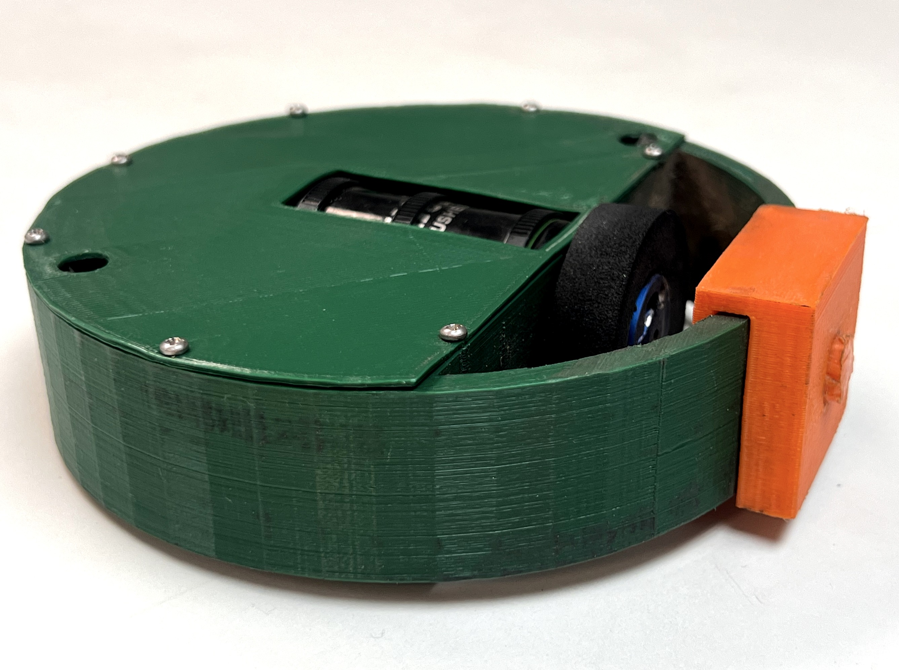

# Open Melt 2 (in progress)

Open Melt is an open-source translational drift (aka "melty brain") robot controller project.  

A translational drift robot spins its entire body using its drive wheel(s), but is still capable of directional control by modulating motor power at certain  points each rotation.  To acheive this - the rate of rotation must be tracked.

<table class="center"><tr><td align="center">
 Antweight Reference Platform</td>
<td valign="center"></td>
<td align="center"> ~2300rpm</td>
</td></tr></table>

Open Melt uses an accelerometer to calculate the rate of rotation based on G-forces around a given radius (centrifugal force).  For example - an accelerometer mounted 4cm from the center of rotation experiencing 145g can be [calculated](https://druckerdiagnostics.com/g-force-calculator/) to indicate 1800rpm rotation.

An LED is turned on once per rotation - giving the appearance of the "front" of the robot.  This allows the driver to see the expected direction of translation.  The user can adjust the heading beacon by moving the remote control left or right.  This also allows for steering and correction of minor tracking errors.

This system can work with robots using either one or two drive motors.

Complete plans for an Antweight (1lbs) combat robot ["reference platform"](./antweight_reference_platform/) are provided.

## General Hardware Requirements

- Arduino Micro (or other Atmega32u4 5v 16MHz Arduino / compatible)
- [H3LIS331](https://www.st.com/resource/en/datasheet/h3lis331dl.pdf) 400g accelerometer (recommended: [Adafruit H3LIS331 breakout](https://www.adafruit.com/product/4627))
- RC Transmittter / Receiver 
- Heading LED
- Motor Driver(s)
- Motor(s)
- 4700uF capacitor

The HSLI311 is a 3v part - but the Adafruit breakout includes a 3v<->5v level converter to make interfacing with the Arduino easy.  Alternatively, [Sparkfun's H3LIS331DL Breakout](https://www.sparkfun.com/products/14480) has been verified to work when used in conjunction with the [SparkFun 3v<->5v Logic Level Converter](https://www.sparkfun.com/products/12009).

Use of an Atmega328-based Arduino is **not** supported due to lack of adequate interrupt pins.
 
Using an ARM-based Arduino has not been tested - but may be possible with code modication (see notes in melty_config.h).

The 4700uF capacitor is required across the 5v power bus to assure motor noise does not cause power fluctuations (and unwanted reboots).

## 1 vs. 2 Wheels
Open Melt generates signals for 2 motors / wheels independant of how many are connected.  There are no configuration changes needed. Motor 2 is powered for the same portion of each rotation as motor 1 (trailing 180 degrees out of phase).

<table class="center"><tr><td>
</td>
<td></td>

<td></td>
</td></tr></table>

In a 1 wheel robot - the unsupported end scrapes the ground during spin-up - but then levitates when it reaches speed.  

In some 1 wheel robots - oscillation / bouncing has been observed at higher speeds - which can reduce translational control.  This phenomina is not fully understood - but may be caused by too-soft wheels deforming / shifting off the center of the hub.  Conversly - harder wheels may cause this problem when they bounce off imperfections in the floor.  

Robots with lower ground clearance seem to experience this problem less.  The reference platform is fairly stable up to about 2800rpm.

2 wheel designs seem less prone to these issues (but are not as cool looking).

## Accelerometer Placement
The accelerometer should be positioned so that it experiences no more than 400g at the robot's anticipated max rotation speed. A [centrifuge calculator](https://druckerdiagnostics.com/g-force-calculator/) may be used to determine this.

Open Melt provides an interactive setup routine that makes precise placement or orientation of the accelerometer unneccessary.

Alignment of the accelerometer off-axis will result in a linear error - which has the same effect as reducing the radius of rotation.  The software also corrects for installing the accelerometer 180 degrees rotated.

## Heading LED

## Motor Driver(s) / Throttle Control

Open Melt can generate either a simple on / off motor signal - or provide a 490Hz PWM signal.

This signal may be fed directly to a MOSFET or motor controller that accepts 5v logic-level input.

The reference platform uses a RFP30N06LE N-Channel MOSFET.

Note: If using a MOSFET - an appropriately sized Schottky diode *must* be installed across the motor leads. 

Brushless RC motor controllers that support high-speed 490Hz PWM may work with Open Melt.  A "Hobbypower 30a" brushless controller running the [SimonK firmware](https://github.com/sim-/tgy) has been tested and found to work.  Other controllers running SimonK firmware may also work.

Open Melt supports a few different configurations to control throttle / rotation speed.  See melty_config.h for configuration options.

## Schematic

## Reference Platform

## Remote Control
Open Melt is controlled using a standard RC control system.  

Be sure to choose a receiver that fail-safes the throttle to 0% (and verify it works correctly). 

## Safety / Disclaimer

- Disclaimer
- Watchdog

## Users Guide
 - Work in progress...
