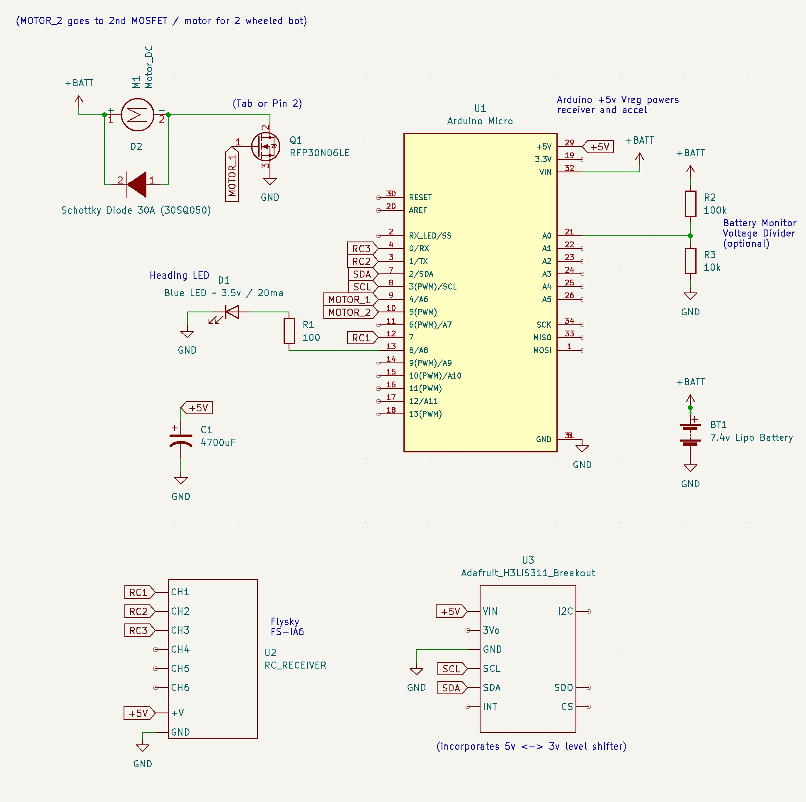
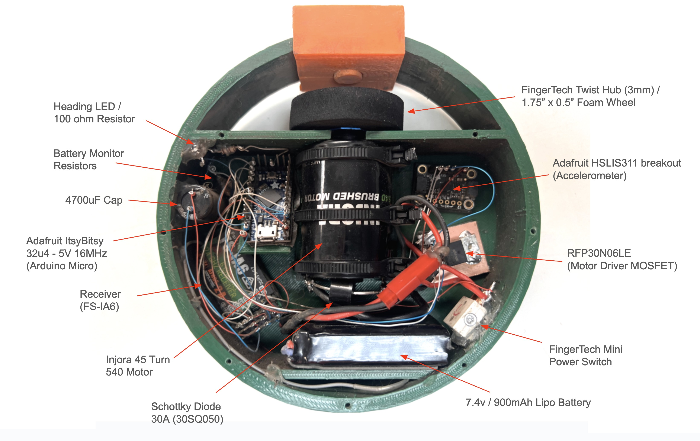

# Open Melt 2

Open Melt is an open-source translational drift (aka "melty brain") robot controller project.  

A translational drift robot spins its entire body using its drive wheel(s), but is still capable of directional control by modulating motor power at certain points each rotation.  To acheive this - the rate of rotation must be tracked.

<table class="center"><tr><td>
</td>
<td valign="center"></td>
<td></td>
</td></tr></table>

Open Melt uses an accelerometer to calculate the rate of rotation based on G-forces around a given radius (centrifugal force).  For example - an accelerometer mounted 4cm from the center of rotation experiencing 145g can be [calculated](https://druckerdiagnostics.com/g-force-calculator/) to indicate 1800rpm rotation.

An LED is turned on once per rotation - giving the appearance of the "front" of the robot.  This allows the driver to see the expected direction of translation.  The user can adjust the heading beacon by moving the remote control left or right.  This also allows for steering and correction of minor tracking errors.

This system can work with robots using either one or two drive motors.

## General Hardware Requirements

- Arduino Micro (or other Atmega32u4 5v 16MHz Arduino)
- HSLIS311 +/-400g accelerometer (recommended: [Adafruit HSLIS311 breakout](https://www.adafruit.com/product/4627))
- RC Transmittter / Receiver 
- Heading LED
- Motor Driver(s)
- Motor(s)
- 4700uF capacitor

Adafruit's ItsyBitsy 32u4 - 5V 16MHz has been tested and works.  

The HSLI311 is a 3v part - but the Adafruit breakout conveniently includes a 3v<->5v level converter.  Alternatively, [Sparkfun's H3LIS331DL Breakout](https://www.sparkfun.com/products/14480) may be used in conjunction with the [SparkFun 3v<->5v Logic Level Converter](https://www.sparkfun.com/products/12009) (verified).

Use of an Atmega328-based Arduino is **not** supported due to lack of adequate interrupt pins.
 
Using an ARM-based Arduino has not been tested - but may be possible with code modication (see notes in melty_config.h).

The 4700uF capacitor is required across the 5v power bus to assure motor noise does not cause power fluctuations (and unwanted reboots).

## Schematic

## Reference Platform

## Safety
-RC fail safe
-MOSFET closed failure
-Watchdog

## Users Guide
 - Work in progress...

- Much additional documentation for this project can be found at the beginning of the code
- If you are developing a project using this code - you are invited to let the author know about it
- Code is licensed as Creative Commons Attribution-Noncommercial-Share Alike
- This system is potentially quite dangerous - especially if implented in a larger (over 3lbs) robot
- If you're foolish enough to compile this code - you must read and agree to the included disclaimer first
- 

Accelerometer:
- Needs to measure high G forces (1500rpm at 6cm is 150G) - see centrifuge calculator
- Sparkfun's pre-mounted ADXL193 is the currently recommended solution
- Freescale 200g MMA2301Eg - used extensively in the past (needs SOIC 16 mount / may not be available)

NPN Darlington transistor(s) to drive motor(s):
- MJ11032G has been tested extensively in smaller robots
- Solid state relays may be a good option for larger robots - but will require minor wiring changes

Some kind of motor(s) / wheel(s)
- Project works fine with either 1 or 2 motors
- Hard rubber doesn't work that well
- Foam wheels seem to work best (see wheel comparison video)

A heading LED
- Use the correct size limiting resistor
- Be careful not to overload your voltage regulator or the Orangutan's motor controller

Brushless Motor / Controller Option:
- Open Melt now supports brushless motors / controllers via high update rate PWM
- Any brushless motor controller supporting input PWM frequencies over 305 hz should work (although this specification is usually not listed)
- Testing was specifically done with a Hobbywing Pentium-18a
- Openpilot.org lists other ESCs that support high refresh rates which will likely work (but haven't been tested)
- All wiring is the same - except that motor control pins (PD2 and PD4) are connected directly to the signal pin of the ESC
- See code for additional documentation / notes (thanks to Richard Wong for his research on this)
